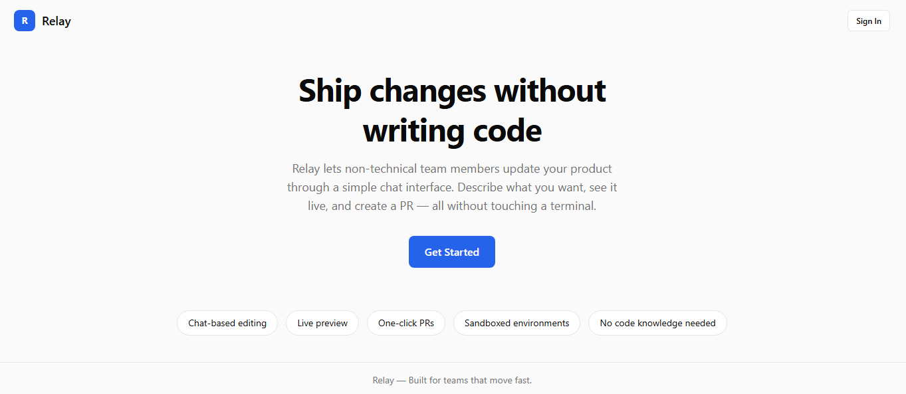
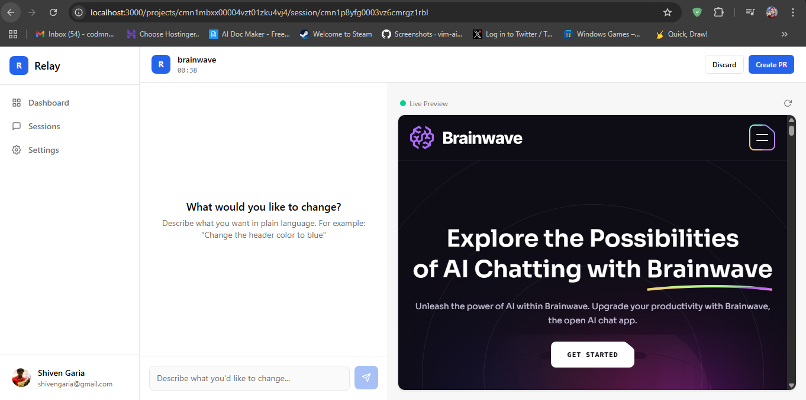

# Relay

**Ship changes without writing code.**

Relay is a SaaS platform that lets non-technical team members - CEOs, PMs, designers, marketers - make real changes to a live codebase through a simple chat interface. No terminal, no code editor, no Git knowledge required. Just describe what you want, watch it happen in a live preview, and create a pull request with one click.



## What Makes Relay Different

Unlike developer-focused tools like GitHub Copilot, Cursor, or Devin, Relay is purpose-built for people who have never opened a terminal:

- **No technical UI** - No code editors, no diffs, no terminal output. Users see clean, human-readable messages and a live preview of their changes.
- **Response refinement** - Raw AI output is automatically rewritten into simple, friendly language. Instead of "Updated `src/components/Header.tsx` line 42", users see "I've updated the header - check the preview!"
- **Sandboxed safety** - Every session runs in an isolated E2B sandbox. Users can't break production. Changes only ship when a PR is explicitly created and reviewed by a developer.
- **Organization-level access** - A developer sets up the project once (repo, env vars, start command), then the entire team can make changes without any setup.

## How It Works

1. **A developer sets up the org** - Creates an organization, links a GitHub repo, configures environment variables, and provides an Anthropic API key.
2. **A team member starts a session** - Clicks "Start Session" on a project. Relay spins up a sandboxed environment, clones the repo, installs dependencies, and boots the dev server.
3. **Chat to make changes** - Describe what you want in plain language: "Change the heading to Welcome", "Make the button blue", "Add a new section below the hero".
4. **See changes live** - The right panel shows a live preview of the running app, updating in real-time as the AI makes changes.
5. **Create a PR or discard** - When satisfied, click "Create PR" to push changes as a pull request on GitHub. Or click "Discard" to throw everything away.



## Key Features

- **Chat-based editing** - Describe changes in plain English. The AI agent handles the code.
- **Live preview** - See your changes instantly in an embedded preview of the running application.
- **One-click PRs** - Push all session changes as a GitHub pull request with an auto-generated description.
- **Sandboxed environments** - Each session runs in an isolated E2B sandbox. No risk to production.
- **Multi-framework support** - Works with Next.js, React, Vite, and other Node.js projects out of the box.
- **Google and GitHub OAuth** - Sign in with your existing accounts. No new passwords to remember.
- **Organization and roles** - Admins configure projects; members start sessions. Clear separation of responsibilities.
- **Encrypted secrets** - API keys and environment variables are encrypted at rest using AES-256-GCM.
- **Session history** - Browse past sessions, see outcomes (PR created, discarded), and track team contributions.
- **Responsive design** - Works on desktop, tablet, and mobile screens.

## Tech Stack

| Layer | Technology |
|-------|-----------|
| Framework | Next.js 15 (App Router) |
| Language | TypeScript |
| Styling | Tailwind CSS v4, Radix UI |
| Database | PostgreSQL (Neon) |
| ORM | Prisma |
| Auth | NextAuth v5 (JWT strategy) |
| AI Agent | Anthropic Claude API (tool use) |
| Sandboxes | E2B SDK |
| Git Integration | Octokit |

## Prerequisites

Before setting up Relay, you will need:

- **Node.js** 18+ and npm
- **PostgreSQL database** - [Neon](https://neon.tech) (recommended for serverless) or any PostgreSQL instance
- **GitHub OAuth App** - Create one at [GitHub Developer Settings](https://github.com/settings/developers)
- **Google OAuth credentials** - Create at [Google Cloud Console](https://console.cloud.google.com/apis/credentials)
- **E2B API key** - Sign up at [e2b.dev](https://e2b.dev) and grab an API key
- **Anthropic API key** - Get one from [console.anthropic.com](https://console.anthropic.com) (required for the AI agent, provided per-org during setup)

## Getting Started

### 1. Clone the repository

```bash
git clone https://github.com/Shiven0504/Relay.git
cd Relay
```

### 2. Install dependencies

```bash
npm install
```

### 3. Configure environment variables

Copy the example env file and fill in your values:

```bash
cp .env.example .env
```

Open `.env` and configure each variable:

| Variable | Description |
|----------|-------------|
| `DATABASE_URL` | PostgreSQL connection string |
| `AUTH_SECRET` | NextAuth secret (generate with `npx auth secret`) |
| `AUTH_URL` | Your app URL (`http://localhost:3000` for local dev) |
| `AUTH_GITHUB_ID` | GitHub OAuth App Client ID |
| `AUTH_GITHUB_SECRET` | GitHub OAuth App Client Secret |
| `AUTH_GOOGLE_ID` | Google OAuth Client ID |
| `AUTH_GOOGLE_SECRET` | Google OAuth Client Secret |
| `ENCRYPTION_KEY` | 32-byte hex key for encrypting secrets at rest |
| `E2B_API_KEY` | E2B API key for sandbox environments |

Generate an encryption key:

```bash
node -e "console.log(require('crypto').randomBytes(32).toString('hex'))"
```

### 4. Set up the database

Push the Prisma schema to your database:

```bash
npx prisma db push
```

### 5. Run the development server

```bash
npm run dev
```

Open [http://localhost:3000](http://localhost:3000) in your browser.

### 6. First-time setup

1. Sign in with GitHub or Google
2. Create an organization and enter your Anthropic API key
3. Add a project by selecting a GitHub repository
4. Configure the start command (e.g., `npm run dev`), environment variables, and agent context
5. Start a session and begin chatting

## Project Structure

```
src/
  app/
    (auth)/           # Sign-in pages
    (app)/            # Authenticated app shell
      dashboard/      # Project listing and active session banner
      sessions/       # Session history
      settings/       # Org and team settings
      projects/
        new/          # Add a new project
        [projectId]/
          session/
            new/      # Start a new session
            [sessionId]/  # Chat + live preview interface
    api/
      auth/           # NextAuth route handlers
      sessions/       # Session CRUD + message, PR, discard endpoints
      projects/       # Project setup API
      org/            # Organization management
  lib/
    auth.ts           # NextAuth configuration
    db.ts             # Prisma client
    e2b.ts            # E2B sandbox lifecycle (create, run, destroy)
    agent.ts          # Claude AI agent with tool use
    crypto.ts         # AES-256-GCM encryption/decryption
    utils.ts          # Shared utilities
  components/ui/      # Reusable UI components (shadcn)
prisma/
  schema.prisma       # Database schema
```

## Available Scripts

| Command | Description |
|---------|-------------|
| `npm run dev` | Start dev server with Turbopack |
| `npm run build` | Production build |
| `npm start` | Start production server |
| `npm run lint` | Run ESLint |
| `npm run db:generate` | Regenerate Prisma client |
| `npm run db:push` | Push schema changes to database |
| `npm run db:migrate` | Run database migrations |
| `npm run db:studio` | Open Prisma Studio |

## License

MIT
